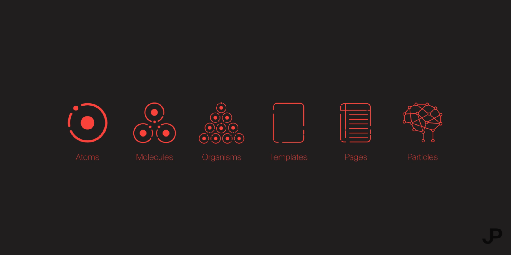

# Design System
Components are built using the Atomic Design system.

## Learn
- [Atomic Design: What is it and why is it important in 2022? (P+S)](https://youtu.be/Yi-A20x2dcA)
- [Atomic Design: How To Make Web and UI Design Easier (The Futur)](https://youtu.be/W3A33dmp17E)
- [Atomic Design: An Event Apart Austin 2015 (Brad Frost)](https://youtu.be/W-h1FtNYim4)

## Configure
- [Learn more about Histoire](https://histoire.dev/)
